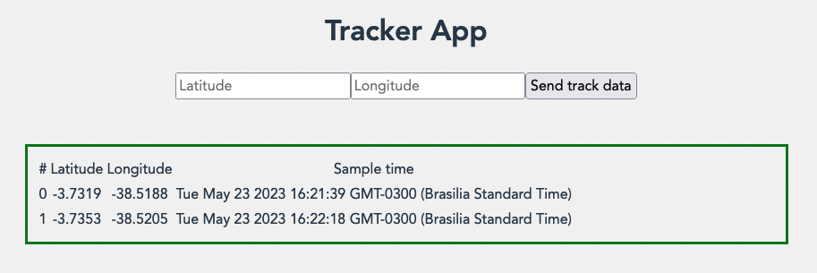
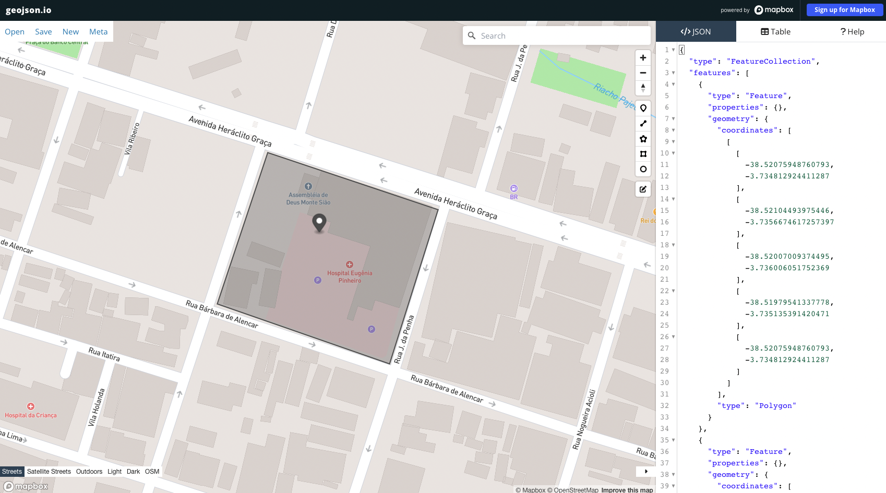

# TRACKER
The [AWS Location Service](https://aws.amazon.com/location/) enables rendering maps, searching locations, and tracking device positions.

This project shows how one can track devices and get notified when a delimited area is crossed. This project is based on the [AWS Geofencing and tracking](https://docs.aws.amazon.com/location/latest/developerguide/geofence-an-area.html) official documentation.

## Overview
The Figure below shows the application home screen. After signing in, one can register a track device location. The table shows the location history.



### Tracker
This is a resource of AWS location service that enables tracking device location. The device sends data to the service. One can check the location history by querying the location service API for the device.

### Geofencing
It is another AWS location service resource. Geofencing enables creating boundaries and reacting when these boundaries are crossed. The Figure below exemplifies a geofence. You can set the geofence area using tools, like [`geojson.io`](http://geojson.io).



### Integration
This project uses [AWS Amplify](https://docs.amplify.aws) to integrate with [Amazon Cognito](https://docs.aws.amazon.com/cognito/latest/developerguide/what-is-amazon-cognito.html) for authentication (user pool) and authorisation (identity pool). The project also uses the [native AWS JS SDK](https://docs.aws.amazon.com/AWSJavaScriptSDK/v3/latest/clients/client-location/) for accessing AWS location service.

One can create a geofence as follows:
```
aws location \
        put-geofence \
            --collection-name Home \
            --geofence-id HomeArea \
            --geometry 'Polygon=[[[-38.52075948760793, -3.734812924411287],[-38.52104493975446, -3.7356674617257397],[-38.52007009374495, -3.736006051752369],[-38.51979541337778, -3.735135391420471],[-38.52075948760793, -3.734812924411287]]]'
```

## Run the Project

1. Ensure the infrastructure: Cognito User and Identity pools, permissions, geofence, tracker, association between geofence and tracker, EventBridge rule, and CloudWatch log group.

2. Update the [`main.js`](./src/main.js) file with your AWS region, user and identity pool IDs, and webclient ID.

3. Ensure you have node installed. Run `yarn` & `yarn dev`

4. Open you browser at [localhost:5173](http://localhost:5173). Sign up, sign in and send some track data.